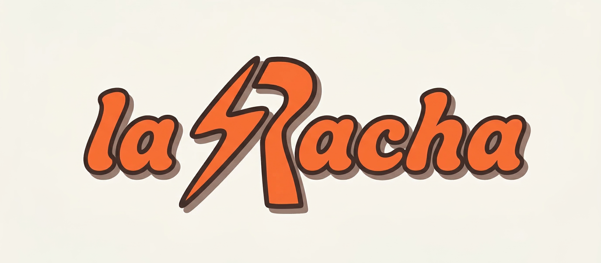

  <h1>⚡ La Racha ⚡</h1> 
  
<em>Menos scrolling y más verse las caras.</em>

## 📖 La Historia (o por qué existe esto)
Todo empezó el 31 de octubre de 2025, mis amigos y yo llevabamos quedando varias semanas seguidas (cosa casi imposible en el mundo en que vivimos). Empezamos apuntando nuestras quedadas en una hoja de Notion, anotando quién venía y qué comíamos. Pero seamos sinceros: los chats grupales se pierden y Notion es demasiado rígido para motivar a la gente a interactuar.

Así nace **La Racha**: de la necesidad de documentar nuestros momentos, tanto los importantes como los cotidianos, y combatir esa desconexión social de pasarnos más de 10h diarias pegados a una pantalla. 

## ✨ ¿Qué hace especial a La Racha?
No es una red social pública, es un refugio privado para tu grupo de amigos.

* **🔥 Mantén la Racha:** Queda de forma consecutiva (en semanas) con más de tres personas de tu grupo.
* **🏆 Sistema de Insignias:** Desbloquead logros por mantener la racha viva (2 semanas, 1 mes, 1 trimestre, 1 año...).
* **📸 Momentos y Highlights:** Documentad todo con fotos, descripciones y guardad los *inside jokes* más memorables de cada quedada.
* **🎁 La Racha Wrapped:** ¿Os imagináis saber cuántas hamburguesas habéis comido juntos en un año o quién es el que más asiste? La IA genera informes estadísticos visuales con los datos históricos del grupo.

## 🎯 ¿Para quién es?
Para jóvenes de entre 16 y 30 años con grupos cerrados de 3 a 10 amigos que valoran las relaciones auténticas, la nostalgia y prefieren los recuerdos accesibles por encima de los likes vacíos.

## 🛠️ Stack y Desarrollo
* **Metodología:** Desarrollado utilizando **Vibe Coding** (desarrollo de software guiado por lenguaje natural mediante agentes de Inteligencia Artificial).
* **Arquitectura:** Sistema multi-tenant enfocado en la privacidad extrema de los datos de cada grupo.

---

### 🤓 ¿Quieres ver las tripas del proyecto?
Si eres un dev curioso, un inversor o simplemente te gusta el salseo técnico, puedes leer toda la arquitectura, el diseño del sistema y los modelos de datos en nuestra [Documentación de Requisitos (RPD)](docs/rpd.md).
