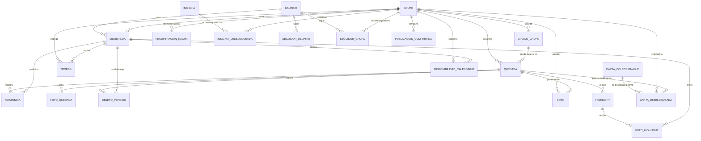

# Modelo Conceptual Detallado

## Uso De Este Documento

Este es el archivo recomendado para generar en Eraser el **modelo completo** de La Racha.

Incluye MVP y módulos futuros: highlights, fotos, álbum, trofeos, cartas coleccionables, calendario, capa social y publicaciones compartidas.

Este documento recoge el modelo completo de La Racha, incluyendo MVP y módulos futuros.

Está pensado para pasarlo a un diagrama conceptual.

## Entidades Del Núcleo

```text
USUARIO
- id
- nombre
- username
- email
- fecha_nacimiento
- avatar_global
- fecha_creacion
- fecha_actualizacion
```

Relaciones:

- Un usuario puede tener muchas membresías.
- Un usuario puede seguir usuarios en el futuro.
- Un usuario puede seguir grupos en el futuro.
- Un usuario puede ver un salón de la fama personal construido a partir de los grupos donde participa.
- La fecha de nacimiento permite calcular edad cuando haga falta, sin guardar una edad estática.

```text
GRUPO
- id
- nombre
- descripcion
- foto_perfil
- privacidad
- frecuencia_racha
- tregua_verano_activa
- fecha_creacion
- fecha_actualizacion
```

Relaciones:

- Un grupo tiene muchas membresías.
- Un grupo tiene muchas quedadas.
- Un grupo tiene muchas opciones reutilizables.
- Un grupo puede tener álbum, trofeos, cartas desbloqueadas, insignias, recuperaciones de racha y publicaciones compartidas.
- Un grupo tiene un salón de la fama propio con insignias, highlights y álbum de fotos.

```text
MEMBRESIA
- id
- usuario_id
- grupo_id
- rol
- apodo
- avatar_grupo
- estado
- fecha_entrada
- fecha_actualizacion
```

Relaciones:

- Una membresía pertenece a un grupo.
- Puede estar asociada a un usuario.
- Puede asistir a quedadas.
- Puede recibir trofeos.
- Puede marcar disponibilidad de calendario.
- Puede proponer highlights.
- Puede votar highlights.

```text
QUEDADA
- id
- grupo_id
- titulo
- fecha
- conductor_membresia_id
- creada_por_membresia_id
- tipo_plan
- momento_dia
- lugar
- comida
- duracion
- notas
- fecha_creacion
- fecha_actualizacion
```

Relaciones:

- Una quedada pertenece a un grupo.
- Tiene asistencias.
- Puede tener fotos.
- Puede tener objetos perdidos.
- Puede tener highlights.
- Puede desbloquear cartas coleccionables.

```text
FOTO_QUEDADA
- id
- quedada_id
- url
- descripcion
- fecha_creacion
```

Relaciones:

- Pertenece a una quedada.

```text
OBJETO_PERDIDO
- id
- quedada_id
- membresia_id
- descripcion
- fecha_creacion
```

Relaciones:

- Pertenece a una quedada.
- Pertenece a una membresía.

```text
ASISTENCIA
- id
- quedada_id
- membresia_id
- estado
```

Relaciones:

- Une una membresía con una quedada.
- En quedadas realizadas, el estado será `asistio` o `no_asistio`.

```text
OPCION_GRUPO
- id
- grupo_id
- tipo
- valor
- fecha_creacion
```

Relaciones:

- Pertenece a un grupo.
- Puede usarse en quedadas como comida, lugar o tipo de plan.

## Racha E Insignias

```text
RACHA
- valor_calculado
- frecuencia
- periodo_actual
```

Nota:

- Puede calcularse desde quedadas y asistencias, no tiene por qué ser tabla al inicio.

```text
RECUPERACION_RACHA
- id
- grupo_id
- racha_perdida_periodos
- periodos_necesarios
- periodos_completados
- estado
- fecha_inicio
- fecha_fin
- fecha_creacion
- fecha_actualizacion
```

Relaciones:

- Pertenece a un grupo.

Nota:

- Registra un intento de recuperar una racha perdida.
- Permite mostrar progreso y calcular estadísticas históricas de rachas perdidas y recuperadas.

```text
INSIGNIA
- id
- nombre
- descripcion
- criterio
- tipo
- imagen
- fecha_creacion
```

Relaciones:

- Es catálogo de hitos de racha del grupo.
- Es dato semilla del sistema.

```text
INSIGNIA_DESBLOQUEADA
- id
- insignia_id
- grupo_id
- membresia_id
- fecha_desbloqueo
- fecha_creacion
```

Relaciones:

- Registra una insignia conseguida por un grupo.
- `membresia_id` queda disponible para posibles insignias individuales futuras.
- En el salón personal de un usuario, una insignia se mostrará asociada al primer grupo con el que ese usuario la consiguió.

## Recuerdos

```text
FOTO
- id
- grupo_id
- quedada_id
- highlight_id
- autor_membresia_id
- url
- descripcion
- destacada
- fecha_subida
```

```text
ALBUM
- id
- grupo_id
- nombre
- descripcion
```

Nota:

- Puede ser una vista lógica del conjunto de fotos del grupo.
- En la pantalla de grupo, el álbum puede aparecer como sección futura aunque aún no esté implementado.

```text
HIGHLIGHT
- id
- quedada_id
- autor_membresia_id
- texto
- foto
- es_ganador
- fecha_creacion
```

```text
VOTO_HIGHLIGHT
- id
- highlight_id
- votante_membresia_id
- fecha_voto
```

## Trofeos Y Cartas

```text
TROFEO
- id
- grupo_id
- membresia_id
- nombre
- descripcion
- criterio
- rareza
- periodo
- fecha_entrega
```

Nota:

- Los trofeos son reconocimientos personales para membresías, normalmente calculados en el Wrapped.
- Los trofeos pertenecen al salón personal del usuario o al Wrapped, no al salón de la fama de un grupo concreto.

```text
CARTA_COLECCIONABLE
- id
- nombre
- descripcion
- imagen
- rareza
- tipo_plan_asociado
- condicion_desbloqueo
- fecha_creacion
```

```text
CARTA_DESBLOQUEADA
- id
- carta_id
- grupo_id
- quedada_id
- fecha_desbloqueo
```

Nota:

- `CARTA_COLECCIONABLE` es catálogo diseñado previamente.
- `CARTA_DESBLOQUEADA` es la carta conseguida por un grupo.
- En el salón personal, las cartas podrán aparecer como parte de la colección relacionada con los grupos del usuario.

## Salones De La Fama

```text
SALON_FAMA_GRUPO
- grupo_id
- insignias_bloqueadas
- insignias_desbloqueadas
- highlights
- album_fotos
```

Nota:

- Puede ser una vista lógica, no necesariamente una tabla.
- En el MVP mostrará insignias de racha bloqueadas y desbloqueadas.
- En el futuro podrá incluir highlights y álbum de fotos del grupo.
- No muestra trofeos personales.

```text
SALON_FAMA_USUARIO
- usuario_id
- insignias_por_primer_grupo
- trofeos_personales
- cartas_coleccionables
```

Nota:

- Puede ser una vista lógica, no necesariamente una tabla.
- Si el usuario consigue la misma insignia en varios grupos, se mostrará asociada al primer grupo con el que la consiguió.
- En el MVP puede quedar como punto de expansión.

## Calendario Compartido

```text
DISPONIBILIDAD_CALENDARIO
- id
- grupo_id
- membresia_id
- fecha
- momento_dia
- estado
- nota
```

Relaciones:

- Pertenece a un grupo.
- Pertenece a una membresía.

Estados:

- `libre`
- `ocupado`

Nota:

- No representa asistencia a un plan.
- Sirve para detectar días o franjas en las que varias membresías coinciden como libres.
- A partir de una coincidencia de disponibilidad, el administrador puede crear una quedada acordada en el calendario.

## Capa Social Futura

```text
SEGUIDOR_USUARIO
- id
- seguidor_usuario_id
- seguido_usuario_id
- fecha_seguimiento
```

```text
SEGUIDOR_GRUPO
- id
- usuario_id
- grupo_id
- fecha_seguimiento
```

```text
PUBLICACION_COMPARTIDA
- id
- grupo_id
- autor_membresia_id
- tipo
- contenido_id
- texto
- visibilidad
- fecha_publicacion
```

## Relaciones Principales

```text
USUARIO 1 ─── N MEMBRESIA
GRUPO 1 ─── N MEMBRESIA

GRUPO 1 ─── N QUEDADA
GRUPO 1 ─── N OPCION_GRUPO
OPCION_GRUPO 1 ─── N QUEDADA
GRUPO 1 ─── N RECUPERACION_RACHA

QUEDADA 1 ─── N ASISTENCIA
MEMBRESIA 1 ─── N ASISTENCIA
QUEDADA 1 ─── N FOTO_QUEDADA
QUEDADA 1 ─── N OBJETO_PERDIDO
MEMBRESIA 1 ─── N OBJETO_PERDIDO

INSIGNIA 1 ─── N INSIGNIA_DESBLOQUEADA
GRUPO 1 ─── N INSIGNIA_DESBLOQUEADA

GRUPO 1 ─── N FOTO
QUEDADA 1 ─── N FOTO
QUEDADA 1 ─── N HIGHLIGHT
HIGHLIGHT 1 ─── N VOTO_HIGHLIGHT
MEMBRESIA 1 ─── N VOTO_HIGHLIGHT

GRUPO 1 ─── N TROFEO
MEMBRESIA 1 ─── N TROFEO

CARTA_COLECCIONABLE 1 ─── N CARTA_DESBLOQUEADA
GRUPO 1 ─── N CARTA_DESBLOQUEADA
QUEDADA 1 ─── N CARTA_DESBLOQUEADA

GRUPO 1 ─── N DISPONIBILIDAD_CALENDARIO
MEMBRESIA 1 ─── N DISPONIBILIDAD_CALENDARIO

USUARIO 1 ─── N SEGUIDOR_USUARIO
USUARIO 1 ─── N SEGUIDOR_GRUPO
GRUPO 1 ─── N SEGUIDOR_GRUPO
GRUPO 1 ─── N PUBLICACION_COMPARTIDA
```

## Diagrama Mermaid


