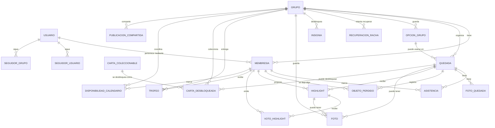

# Modelo Conceptual

## Uso De Este Documento

Este documento sirve para entender el dominio completo de La Racha con explicaciones narradas.

No es el mejor archivo para generar diagramas directamente. Para Eraser usa [modelo-conceptual-detallado.md](modelo-conceptual-detallado.md) si quieres el modelo completo, o [modelo-mvp.md](modelo-mvp.md) si quieres solo el MVP.

El modelo conceptual describe las entidades principales del dominio y cómo se relacionan.

## Entidades Principales

### Usuario

Persona que usa la aplicación.

Relaciones:

- Puede pertenecer a varios grupos mediante membresías.
- En el futuro puede seguir usuarios.
- En el futuro puede seguir grupos.

### Grupo

Espacio privado de un grupo de amigos.

Atributos principales:

- Nombre.
- Descripción.
- Foto de perfil.
- Privacidad.
- Frecuencia de racha.
- Configuración de tregua de verano.

Relaciones:

- Tiene muchas membresías.
- Tiene muchas quedadas.
- Tiene muchas insignias desbloqueadas.
- Tiene recuperaciones de racha.
- En el futuro puede compartir publicaciones públicas.

### Membresía

Representa la pertenencia de una persona a un grupo.

Atributos principales:

- Nombre visible.
- Avatar.
- Rol: administrador o miembro normal.

Relaciones:

- Pertenece a un grupo.
- Puede estar asociado a un usuario.
- Puede asistir a muchas quedadas.
- Puede proponer highlights.
- Puede votar highlights.

### Quedada

Plan realizado por un grupo.

Atributos principales:

- Título.
- Fecha.
- Conductor.
- Tipo de plan.
- Momento del día.
- Lugar.
- Comida.
- Duración.
- Objetos perdidos.
- Fotos.
- Notas.

Relaciones:

- Pertenece a un grupo.
- Tiene muchas asistencias.
- Puede tener varias fotos.
- Puede tener varias personas registradas en objetos perdidos.
- Puede tener muchos highlights.

### Foto De Quedada

Foto asociada a una quedada concreta.

Atributos principales:

- URL.
- Descripción opcional.
- Fecha de creación.

Relaciones:

- Pertenece a una quedada.

En el MVP se guarda como URL simple. Más adelante podrá conectarse con almacenamiento real.

### Objeto Perdido

Registro de que una membresía se dejó algo en una quedada.

Atributos principales:

- Membresía.
- Descripción opcional.

Relaciones:

- Pertenece a una quedada.
- Pertenece a una membresía.

Una quedada puede tener varias personas registradas en objetos perdidos.

### Opción De Grupo

Valor reutilizable dentro de un grupo para campos que se repiten en quedadas.

Ejemplos:

- Comida: McDonalds, hamburguesas, pizza.
- Lugar: parque, casa de Marta, centro comercial.
- Tipo de plan: picnic, cine, cena, paseo.

Atributos principales:

- Tipo.
- Valor.
- Fecha de creación.

Relaciones:

- Pertenece a un grupo.
- Puede ser usada por muchas quedadas.

En el MVP se usará para comida, lugar y tipo de plan. Objetos perdidos queda fuera de este catálogo porque representa la persona que se dejó algo.

### Asistencia

Relación entre una membresía y una quedada ya registrada.

Sirve para indicar qué ocurrió realmente en una quedada.

Atributos principales:

- Estado: asistió o no asistió.

Relaciones:

- Pertenece a una quedada.
- Pertenece a una membresía.

### Racha

Resultado calculado a partir de las quedadas válidas de un grupo.

No tiene por qué ser una entidad persistida al inicio. Puede calcularse desde las quedadas y la configuración del grupo.

Depende de:

- Frecuencia configurada.
- Quedadas válidas.
- Número mínimo de asistentes.
- Reglas especiales como tregua de verano o recuperación.

### Recuperación De Racha

Intento de recuperar una racha perdida.

Atributos principales:

- Racha perdida en periodos.
- Periodos necesarios.
- Periodos completados.
- Estado.
- Fecha de inicio.
- Fecha de fin.

Relaciones:

- Pertenece a un grupo.

Entra en el MVP porque permite mostrar progreso y calcular estadísticas sobre rachas perdidas, recuperaciones completadas y tiempo invertido recuperando.

### Insignia

Logro desbloqueable por un grupo en relación con su racha.

Las insignias son para hitos de continuidad del grupo: 1 semana, 2 semanas, 1 mes, 3 meses, 1 año, etc.

Atributos principales:

- Nombre.
- Descripción.
- Criterio.
- Fecha de desbloqueo.

Relaciones:

- Pertenece al catálogo de insignias de racha.
- Se desbloquea para un grupo.

### Highlight

Propuesta de mejor momento de una quedada.

Atributos principales:

- Texto.
- Foto.
- Autor.
- Votos.

Relaciones:

- Pertenece a una quedada.
- Lo propone una membresía.
- Recibe votos de membresías.

### Foto

Imagen subida por una membresía y asociada al álbum del grupo, un highlight o una publicación compartida.

Atributos principales:

- URL.
- Descripción.
- Fecha de subida.
- Autor.

Relaciones:

- Pertenece a un grupo.
- Puede estar asociada a un highlight.
- Puede formar parte del álbum del grupo.

### Álbum

Colección de fotos y recuerdos de un grupo.

Relaciones:

- Pertenece a un grupo.
- Contiene fotos.
- Puede organizar fotos por quedada, fecha o tipo de recuerdo.

### Trofeo

Logro personal que recibe una membresía dentro de un grupo, normalmente asociado al Wrapped grande del 31 de octubre.

Los trofeos no son lo mismo que las insignias:

- Las insignias son logros de racha del grupo.
- Los trofeos son reconocimientos personales por estadísticas o comportamientos dentro del grupo.

Ejemplos:

- Membresía que más quedadas ha asistido.
- Membresía que más hamburguesas ha comido.
- Membresía que más objetos ha perdido.
- Membresía que menos ha quedado.
- Membresía que más veces ha conducido.

Atributos principales:

- Nombre.
- Descripción.
- Criterio.
- Rareza.
- Periodo.
- Fecha de entrega.

Relaciones:

- Pertenece a un grupo.
- Se entrega a una membresía.
- Puede formar parte de un Wrapped.

### Carta Coleccionable

Carta visual diseñada previamente y desbloqueable según el tipo de plan que registra un grupo.

Cada tipo de plan puede tener una carta coleccionable asociada. Por ejemplo, si un grupo registra por primera vez una quedada de tipo picnic en un parque, desbloquea la carta correspondiente.

Atributos principales:

- Nombre.
- Descripción.
- Imagen.
- Rareza.
- Tipo de plan asociado.
- Condición de desbloqueo.
- Fecha de creación.

Relaciones:

- Pertenece al catálogo de cartas.
- Puede ser desbloqueada por un grupo.
- Puede estar asociada a la quedada que provocó el desbloqueo.

### Carta Desbloqueada

Registro de una carta coleccionable conseguida por un grupo.

Relaciones:

- Pertenece a una carta coleccionable.
- Pertenece a un grupo.
- Puede apuntar a la quedada que la desbloqueó.

### Disponibilidad De Calendario

Bloque de disponibilidad general de una membresía para facilitar que el grupo encuentre días para quedar.

No representa una confirmación de asistencia a un plan concreto.

Atributos principales:

- Fecha.
- Momento del día o franja.
- Estado: libre u ocupado.
- Nota opcional.

Relaciones:

- Pertenece a un grupo.
- Pertenece a una membresía.

Uso esperado:

- Cada membresía marca cuándo está libre u ocupada.
- La app detecta días o franjas donde coinciden varias membresías libres.
- A partir de esa coincidencia, el administrador puede crear una quedada acordada en el calendario.

### Museo Del Grupo

Vista o módulo que agrupa los elementos memorables del grupo.

Puede mostrar:

- Trofeos.
- Insignias.
- Cartas coleccionables.
- Highlights.
- Fotos destacadas.
- Récords.

## Entidades Futuras

### Seguidor De Usuario

Relación entre un usuario seguidor y un usuario seguido.

### Seguidor De Grupo

Relación entre un usuario y un grupo seguido.

### Publicación Compartida

Contenido que un grupo decide hacer visible fuera del espacio privado.

Puede representar:

- Foto.
- Logro.
- Highlight.
- Estadística.
- Hito de racha.

### Wrapped

Resumen visual de un periodo, normalmente anual, con estadísticas y recuerdos del grupo.

Puede incluir:

- Número de quedadas.
- Racha más larga.
- Membresía con más asistencia.
- Comidas más repetidas.
- Lugares más visitados.
- Highlights más votados.
- Fotos destacadas.

## Diagrama Conceptual

## Versión MVP

La versión recortada del modelo para la primera implementación está en [modelo-mvp.md](modelo-mvp.md).
